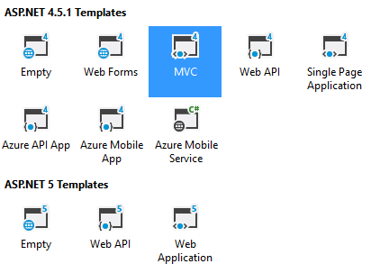
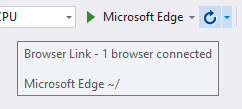

## Browser Link Analyzer
A Visual Studio extension that analyzes the rendered output
of ASP.NET web pages.

### Getting started
Create a new ASP.NET MVC application in Visual Studio 2015.

Run it in th edefault browser by hitting `Ctrl+F5`.

Make sure Browser Link is connected by hovering the mouse
over the Browser Link icon in the Standard toolbar.

You should see at least one Browser connected.

Set a breakpoint in the `CollectSource` method in
RenderedPage.cs to confirm that the HTML source is being
sent to the extension running in VS.

### Other examples
Examples of other Browser Link extensions can be found
in the
[Web Essentials source code](https://github.com/madskristensen/WebEssentials2015/tree/master/EditorExtensions/BrowserLink)